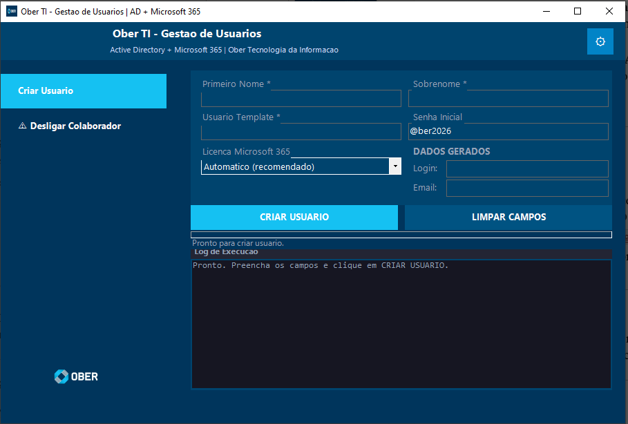
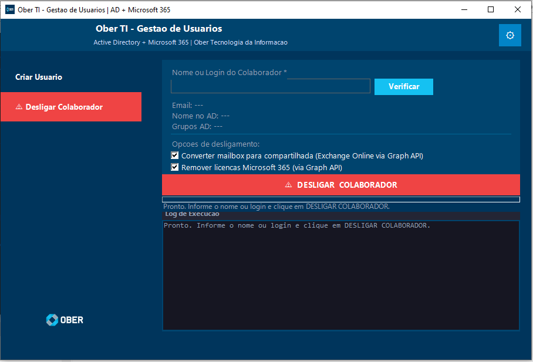

# 🔷 Ober TI — Gestão de Usuários
**Active Directory + Microsoft 365 | Onboarding & Offboarding Automatizado**

> Interface gráfica em PowerShell + WinForms para criação e desligamento de colaboradores com integração completa ao Active Directory e Microsoft 365.

---

## 📸 Interface

| Aba Criação — Onboarding | Aba Desligamento — Offboarding |
|:---:|:---:|
|  |  |

---

## 🎬 Demonstração em vídeo

> 🔗 *Em breve — gravação do processo completo de onboarding e offboarding*

---

## ✨ Funcionalidades

### 🟢 Aba Criação — Onboarding (6 etapas)

| Etapa | Descrição |
|-------|-----------|
| 1 | Verificação de pré-requisitos e conectividade com o AD |
| 2 | Leitura do usuário template (OU, cargo, grupos, gestor, departamento) |
| 3 | Criação do usuário no Active Directory com todos os atributos |
| 4 | Cópia automática de grupos de segurança do template |
| 5 | Sincronização com Azure AD via ADConnect + polling de propagação no M365 |
| 6 | Atribuição automática de licença Microsoft 365 via Graph API |

### 🔴 Aba Desligamento — Offboarding (5 etapas)

| Etapa | Descrição |
|-------|-----------|
| 1 | Verificação do usuário no Active Directory |
| 2 | Redefinição de senha aleatória, desabilitação, expiração, movimentação para OU de desabilitados, remoção de gestor/subordinados, ocultação do catálogo de endereços e bloqueio de logon |
| 3 | Remoção de todos os grupos AD |
| 4 | Conversão da mailbox para compartilhada via Exchange Online (fallback: Graph API beta) |
| 5 | Remoção de licenças Microsoft 365 via Graph API (com 3 tentativas por licença) |

---

## 🔐 Segurança

- Credenciais do Azure AD App Registration e servidor ADSync protegidas com **criptografia DPAPI** (vinculada ao usuário/máquina)
- Senha de desligamento gerada aleatoriamente (14 caracteres, mínimo 4 especiais)
- Suporte a múltiplos métodos de autenticação remota: **Kerberos**, **NTLM** e credencial explícita

---

## ⚙️ Requisitos

- Windows 10/11 ou Windows Server 2016+
- PowerShell 5.1+
- Acesso de rede ao servidor AD / AAD Connect
- **Azure AD App Registration** com permissões:
  - `User.ReadWrite.All`
  - `Directory.ReadWrite.All`
  - `Organization.Read.All`
- **Não é necessário RSAT instalado** — o módulo ActiveDirectory é carregado via PSSession remota automaticamente

---

## 🚀 Como usar

### 1. Configuração inicial

Edite o arquivo `ober_gestao_usuarios.ps1` e preencha as variáveis no topo do arquivo:

```powershell
$CFG_TenantId     = "SEU_TENANT_ID"
$CFG_ClientId     = "SEU_CLIENT_ID"
$CFG_ClientSecret = "SEU_CLIENT_SECRET"

$CFG_Dominio      = "suaempresa.com.br"
$CFG_SenhaInicial = "@SenhaInicial2025"
$CFG_Servidor     = "10.0.0.1"
$CFG_SyncUser     = "DOMINIO\admin"
$CFG_SyncSenha    = "SenhaDoServidor"
$CFG_TargetOU     = "OU=Usuarios Desabilitados,DC=suaempresa,DC=com,DC=br"
```

### 2. Executar

Dê um duplo clique no arquivo `gestao_usuarios.bat` (solicita elevação UAC automaticamente).

### 3. Criar usuário

1. Vá para a aba **Criação**
2. Preencha: Primeiro Nome, Sobrenome e Usuário Template
3. Login e e-mail são gerados automaticamente
4. Selecione a licença Microsoft 365 desejada
5. Clique em **CRIAR USUÁRIO**

### 4. Desligar colaborador

1. Vá para a aba **Desligamento**
2. Digite o username ou nome do colaborador
3. Clique em **Verificar** para confirmar os dados no AD
4. Marque as opções desejadas (Exchange Online, Remoção de Licenças)
5. Clique em **⚠️ DESLIGAR COLABORADOR**

---

## 📁 Estrutura de arquivos
📦 gestao-usuarios/
├── gestao_usuarios.bat          # Launcher (eleva UAC automaticamente)
├── ober_gestao_usuarios.ps1     # Script principal
├── config.xml                   # Credenciais criptografadas (gerado automaticamente)
└── logs/
├── criacao_YYYY-MM.log
├── desligamento_YYYY-MM.log
├── historico_criacao.csv
└── historico_desligamentos.csv

---

## 🛠️ Detalhes técnicos

- **PSSession remota**: carrega o módulo ActiveDirectory via WinRM sem necessidade de RSAT
- **Graph API token cache**: token OAuth 2.0 com cache de 50 minutos e renovação automática
- **Polling de propagação M365**: verifica a cada 15 segundos (até 5 minutos) se o usuário apareceu no M365
- **Exchange Online em Runspace separado**: conversão de mailbox em thread paralela, sem travar a interface
- **Fallback Exchange → Graph API**: se o Exchange Online falhar, tenta via endpoint beta da Graph API

---

## 📊 Logs e rastreabilidade

- Log em tempo real na interface (✔ OK | ✘ ERRO | ⚠ AVISO | ➤ INFO | ▶ ETAPA)
- Arquivo de log mensal em `logs/`
- Registro em CSV com data/hora, operador, usuário e resultado

---

## 🤝 Contribuição

Pull requests são bem-vindos! Para mudanças maiores, abra uma issue primeiro.

---

## 📄 Licença

MIT License

---

*Desenvolvido por Jhonata Sales — Ober Tecnologia da Informação*
